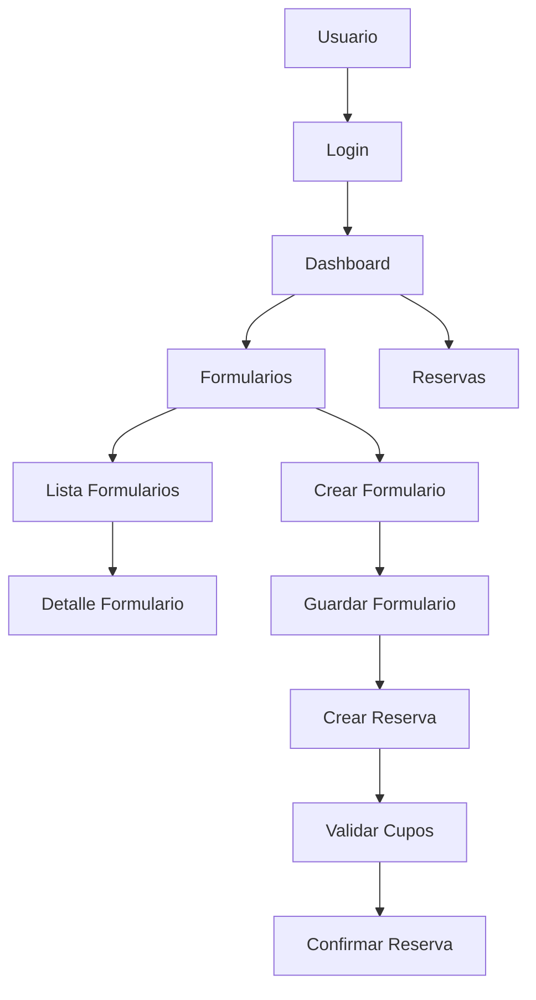

# 🏛️ PROYECTO INDER - Sistema de Gestión de Formularios y Reservas

Sistema integral de gestión desarrollado para el Instituto Nacional de Deportes y Recreación (INDER), que permite la administración de formularios de usuarios y la reserva de servicios deportivos y recreativos.

## 📋 Descripción del Proyecto

Este sistema proporciona una solución completa para:
- Registro y gestión de formularios de usuarios
- Reserva de servicios deportivos y recreativos
- Administración de sedes y disponibilidad
- Control de cupos y horarios
- Gestión de catálogos maestros (comunas, géneros, tipos de documento)

## 🏗️ Arquitectura del Sistema

### Backend (.NET Core 10.0)
- **Framework**: ASP.NET Core 10.0
- **Arquitectura**: Clean Architecture con CQRS
- **ORM**: Entity Framework Core
- **Base de Datos**: SQL Server
- **Autenticación**: JWT Bearer Tokens
- **Patrones**: MediatR, Repository Pattern, DTOs

### Frontend (Vue 3)
- **Framework**: Vue 3 Composition API
- **Estado**: Pinia (Store Management)
- **Routing**: Vue Router 4
- **Estilos**: Tailwind CSS
- **HTTP Client**: Axios
- **Arquitectura**: Clean Architecture

## 📁 Estructura del Proyecto

```
PROYECTO INDER/
├── BACKEND/
│   └── ApiInderV1/              # API REST .NET Core
│       ├── Application/         # Lógica de negocio y casos de uso
│       ├── Configuration/       # Configuración de la aplicación
│       ├── Controllers/         # Controladores API
│       ├── Core/               # Entidades y interfaces
│       ├── Infrastructure/     # Acceso a datos
│       ├── Migrations/         # Migraciones de base de datos
│       └── Services/           # Servicios de aplicación
└── FRONTEND/
    └── InderV1/                # Aplicación Vue 3
        ├── src/
        │   ├── application/    # Casos de uso y stores
        │   ├── core/          # Entidades e interfaces
        │   ├── infrastructure/ # Servicios HTTP
        │   └── presentation/  # Componentes y vistas
        └── public/
```

## 🚀 Características Principales

### 🔐 Autenticación y Seguridad
- Sistema de login/logout con JWT
- Protección de rutas mediante middleware
- Validación de tokens
- Roles de usuario (Admin/User)

### 📝 Gestión de Formularios
- Creación de formularios de usuarios
- Validación de datos
- Búsqueda y filtrado
- Detalle de formularios
- Eliminación segura

### 📅 Sistema de Reservas
- Creación de reservas
- Validación de disponibilidad de cupos
- Gestión de múltiples servicios por reserva
- Asociación con sedes
- Historial de reservas

### 📊 Catálogos Maestros
- Comunas
- Géneros
- Sedes
- Servicios
- Tipos de documento

## 🛠️ Tecnologías Utilizadas

### Backend
| Tecnología | Versión | Propósito |
|------------|---------|-----------|
| .NET Core | 10.0 | Framework principal |
| Entity Framework Core | 10.0.2 | ORM y acceso a datos |
| SQL Server | - | Base de datos |
| JWT Bearer | 10.0.2 | Autenticación |
| MediatR | 12.4.1 | Patrón CQRS |
| Swagger | 10.1.0 | Documentación API |

### Frontend
| Tecnología | Versión | Propósito |
|------------|---------|-----------|
| Vue.js | 3.4.0 | Framework frontend |
| Pinia | 2.1.0 | Gestión de estado |
| Vue Router | 4.2.0 | Enrutamiento |
| Tailwind CSS | 3.4.0 | Estilos y diseño |
| Axios | 1.6.0 | Cliente HTTP |
| Vite | 5.0.0 | Bundler y dev server |

## 📋 Requisitos del Sistema

### Backend
- .NET Core SDK 10.0 o superior
- SQL Server (Express o Standard)
- Visual Studio 2022 o VS Code

### Frontend
- Node.js 16.x o superior
- npm 8.x o superior
- Editor de código (VS Code recomendado)

## ⚙️ Instalación y Configuración

### 1. Clonar el Repositorio
```bash
git clone <url-del-repositorio>
cd "PROYECTO INDER"
```

### 2. Configurar el Backend
```bash
cd BACKEND/ApiInderV1
dotnet restore
```

#### Configurar cadena de conexión (appsettings.json):
```json
{
  "ConnectionStrings": {
    "DefaultConnection": "Server=TU_SERVIDOR;Database=ApiInderV1Db;Trusted_Connection=true;TrustServerCertificate=true;"
  }
}
```

#### Ejecutar migraciones:
```bash
dotnet ef database update
```

#### Iniciar el backend:
```bash
dotnet run
# La API estará disponible en: http://localhost:5000
# Documentación Swagger: http://localhost:5000/swagger
```

### 3. Configurar el Frontend
```bash
cd ../../FRONTEND/InderV1
npm install
```

#### Iniciar el frontend:
```bash
npm run dev
# La aplicación estará disponible en: http://localhost:3000
```

## 🔧 Variables de Entorno

### Backend (.env o appsettings.json)
```json
{
  "AppSettings": {
    "Security": {
      "JwtSecretKey": "tu_clave_secreta_muy_larga_y_segura_aqui",
      "TokenExpirationHours": 24
    }
  }
}
```

### Frontend (.env)
```bash
VITE_API_URL=http://localhost:5000/api
```

## 📡 Endpoints de la API

### Autenticación
- `POST /api/auth/login` - Iniciar sesión
- `POST /api/auth/register` - Registrar usuario ⚠️ *Sin protección*
- `POST /api/auth/validate-token` - Validar token

### Formularios
- `GET /api/formularios` - Obtener todos los formularios
- `GET /api/formularios/{id}` - Obtener formulario por ID
- `POST /api/formularios` - Crear nuevo formulario *(requiere autenticación)*
- `PUT /api/formularios/{id}` - Actualizar formulario
- `DELETE /api/formularios/{id}` - Eliminar formulario

### Reservas
- `GET /api/reservas` - Obtener todas las reservas
- `GET /api/reservas/{id}` - Obtener reserva por ID
- `GET /api/reservas/por-formulario/{formularioId}` - Reservas por formulario
- `POST /api/reservas` - Crear nueva reserva
- `POST /api/reservas/validar-cupos` - Validar disponibilidad

### Catálogos
- `GET /api/comunas` - Comunas
- `GET /api/generos` - Géneros
- `GET /api/sedes` - Sedes
- `GET /api/servicios` - Servicios
- `GET /api/tiposdocumento` - Tipos de documento

## ⚠️ Consideraciones de Seguridad

### Endpoint `/api/auth/register`
**Estado actual**: Sin protección JWT

**Justificación técnica**:
- Permitido en etapa inicial para facilitar el registro de usuarios
- Necesario para flujos de onboarding sin autenticación previa
- Común en sistemas donde los usuarios pueden registrarse públicamente

**Riesgos identificados**:
- Registro masivo automatizado sin control
- Posible abuso para crear cuentas falsas
- Vulnerabilidad a ataques de fuerza bruta

**Medidas de seguridad recomendadas**:
1. **Rate Limiting**: Implementar límites de solicitudes por IP
2. **CAPTCHA**: Agregar verificación humana
3. **Validación de dominios de correo**: Restringir correos corporativos
4. **Activación por correo**: Confirmación de cuenta por email
5. **Restricción por rol**: `[Authorize(Roles = "Admin")]` para registro administrativo
6. **Monitoreo**: Registrar intentos de registro sospechosos

## 🧪 Pruebas

### Pruebas Backend
```bash
cd BACKEND/ApiInderV1
dotnet test
```

### Pruebas Frontend
```bash
cd FRONTEND/InderV1
npm run test
```

## 📊 Diagrama de Flujo del Sistema



## 👥 Equipo de Desarrollo

- **Desarrollador Principal**: Willian
- **Arquitectura**: Clean Architecture + CQRS
- **Metodología**: Desarrollo incremental

## 📅 Historial de Versiones

### v1.0.0 (Inicial)
- ✅ Estructura base del proyecto
- ✅ Integración backend-frontend
- ✅ Sistema de autenticación básico
- ✅ CRUD de formularios
- ✅ Gestión de reservas
- ✅ Catálogos maestros

## 📞 Soporte

Para reportar problemas o sugerencias:
- Crear un issue en el repositorio
- Contactar al equipo de desarrollo

## 📄 Licencia

MIT License - Ver archivo LICENSE para detalles

---
*Desarrollado para el Instituto Nacional de Deportes y Recreación (INDER)*